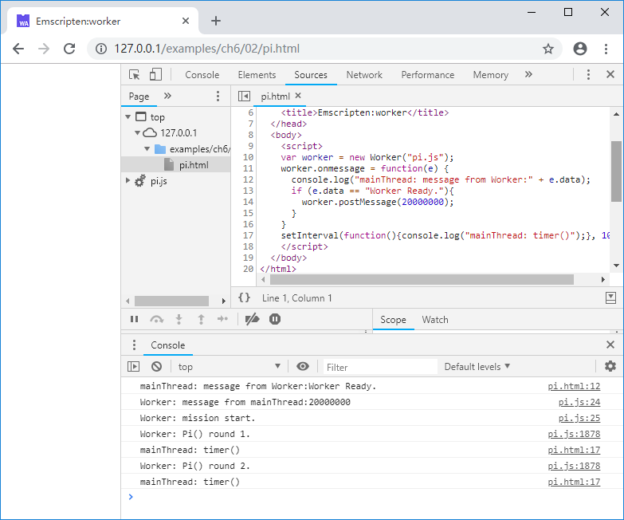
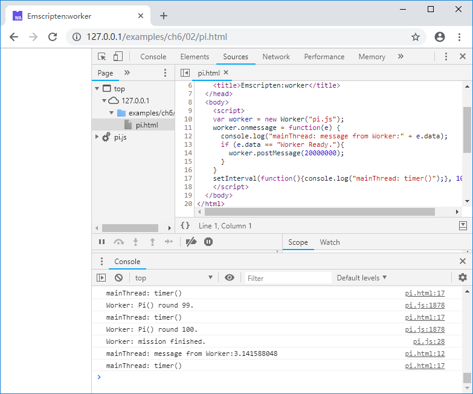

# 6.2 在Worker中使用Emscripten

本节将展示一个使用Emscripten及`Worker`的并发执行的例子。

先来看C部分的代码：

```c
//pi.cc
double Random()
{
	static int seed = 1;
	static int const a = 16807, m = 2147483647, q = 127773, r = 2836;

	seed = a * (seed % q) - r * (seed / q);
	if (seed < 0) seed += m;
	return (double)seed / (double)m;
}

EM_PORT_API(double) Pi(int trials)
{
	double sum = 0.0;
	for (int j = 0; j < 100; j++)
	{
		int hits = 0;
		for (int i = 0; i < trials; i++)
		{
			double x = Random();
			double y = Random();
			if (x * x + y * y < 1.0)
				hits++;
		}
		sum += 4.0 * hits / trials;
		printf("Worker: Pi() round %d.\n", j + 1);
	}
	return sum / 100.0f;
}
```

C代码导出了`Pi()`函数，该函数使用概率法计算圆周率，函数的输入参数为每轮抛骰子的次数，函数内部将重复100轮，每轮计算结束时都将输出轮数信息。

在编译之前，我们额外准备一个`pre.js`文件（该文件将被插入emcc生成的js文件之前），代码如下：

```js
//pre.js
Module = {};
Module.onRuntimeInitialized = function() {
  postMessage("Worker Ready.");
}

onmessage = function(e){
  console.log("Worker: message from mainThread:" + e.data);
  console.log("Worker: mission start.");
  var p = Module._Pi(e.data);
  postMessage(p);
  console.log("Worker: mission finished.");
}
```

`pre.js`中定义了`onmessage()`回调函数用于处理来自主线程的消息。在本例中，`onmessage()`函数将根据主线程传来的参数计算圆周率，并将计算结果通过`postMessage()`方法发送回主线程。另外，即使在`Worker`中，`Module`的编译和初始化仍然是异步的，`Worker`加载完js文件并不意味着`Module`运行时可用，因此仍然需要采取某种通知机制，确保`Worker`在开始调用`Module`前`Module`已经初始化完成。在本例中，我们仍然采用的是设置`Module.onRuntimeInitialized`回调的方法来通知主线程`Module`准备完毕的消息。

使用以下命令编译：

```
emcc pi.cc --pre-js pre.js -o pi.js
```

主线程（既网页部分）的代码如下：

```js
//pi.html
    var worker = new Worker("pi.js");
    worker.onmessage = function(e) {
      console.log("mainThread: message from Worker:" + e.data);
      if (e.data == "Worker Ready."){
        worker.postMessage(20000000);
      }
    }
    setInterval(function(){console.log("mainThread: timer()");}, 1000);
```

这部分很简单，当收到"Worker Ready."确认`Worker`中的`Module`准备完毕后，发送任务参数`2000000`给`Worker`计算圆周率。

浏览页面，控制台将输出：



若此时打开CPU资源监视器，可以看到一个CPU核心由于`Worker`中执行的运算，处于满负荷状态；主线程并未阻塞仍然在定时输出timer日志，1~2分钟后，`Worker`执行完成，将传回圆周率结果：


