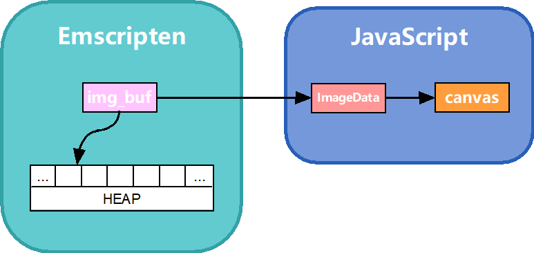
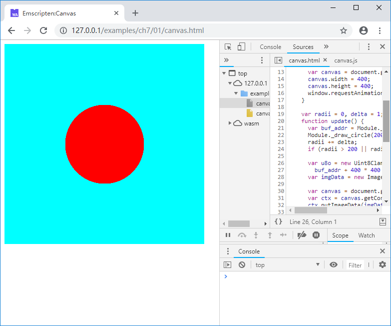

# 7.1 Canvas

`Canvas`对象与Windows系统中的DC对象很相似，它是屏幕上的一块矩形区域，提供了划线、填充、字符输出等一系列操作，最重要的是，它可以直接读写区域中任意像素的RGBA值，这使得我们可以在`Canvas`上绘制任意图像。

本节的例程创建包含了一个`Canvas`的页面，`Canvas`上将绘制一个直径周而复始变大变小的红色的圆。其中：

- C代码负责图像数据的管理以及圆的绘制；
- JavaScript代码负责图像数据向`Canvas`的更新及动画调度。

C代码如下：

```c
//canvas.html
uint8_t *img_buf = NULL;
int img_width = 0, img_height = 0;

EM_PORT_API(uint8_t*) get_img_buf(int w, int h) {
	if (img_buf == NULL || w != img_width || h != img_height) {
		if (img_buf) {
			free(img_buf);
		}
		img_buf = (uint8_t*)malloc(w * h * 4);
		img_width = w;
		img_height = h;
	}

	return img_buf;
}

EM_PORT_API(void) draw_circle(int cx, int cy, int radii) {
	int sq = radii * radii;
	for (int y = 0; y < img_height; y++) {
		for (int x = 0; x < img_width; x++) {
			int d = (y - cy) * (y - cy) + (x - cx) * (x - cx);
			if (d < sq) {
				img_buf[(y * img_width + x) * 4] = 255;		//r
				img_buf[(y * img_width + x) * 4 + 1] = 0;	//g
				img_buf[(y * img_width + x) * 4 + 2] = 0;	//b
				img_buf[(y * img_width + x) * 4 + 3] = 255;	//a
			}
			else {
				img_buf[(y * img_width + x) * 4] = 0;		//r
				img_buf[(y * img_width + x) * 4 + 1] = 255;	//g
				img_buf[(y * img_width + x) * 4 + 2] = 255;	//b
				img_buf[(y * img_width + x) * 4 + 3] = 255;	//a
			}
		}
	}
}
```

`img_buf`指向用于保存位图数据的缓冲区，`get_img_buf()`函数将根据传入的参数判断是否需要重新创建缓冲区。`draw_circle()`函数将在指定位置以指定半径填充绘制圆。

网页部分代码如下：

```html
//canvas.html
    <canvas id="myCanvas"></canvas>
    <script>
    Module = {};
    Module.onRuntimeInitialized = function() {
      var canvas = document.getElementById('myCanvas');
      canvas.width = 400;
      canvas.height = 400;
      window.requestAnimationFrame(update);
    }

    var radii = 0, delta = 1;
    function update() {
      var buf_addr = Module._get_img_buf(400, 400);
      Module._draw_circle(200, 200, radii);
      radii += delta;
      if (radii > 200 || radii < 0) delta = -delta;

      var u8o = new Uint8ClampedArray(Module.HEAPU8.subarray(buf_addr,
        buf_addr + 400 * 400 * 4));
      var imgData = new ImageData(u8o, 400, 400);

      var canvas = document.getElementById('myCanvas');
      var ctx = canvas.getContext('2d');
      ctx.putImageData(imgData, 0, 0);

      window.requestAnimationFrame(update);
    }
    </script>
    <script src="canvas.js"></script>
```

html中声明了id为`myCanvas`的`Canvas`元素，在每帧更新时，从Emscripten运行时`Module`中取出图像数据，创建`ImageData`对象`imgData`，并将`imgData`通过`CanvasRenderingContext2D`对象`ctx`更新到`Canvas`上去。整体的数据流程如下图所示：



使用以下命令编译：

```
emcc canvas.cc -o canvas.js
```

浏览页面，青色背景上将显示一个不断变大变小的红色圆：



事实上`Canvas`对象已经内置包括圆、矩形、扇形等多种几何图形的绘制方法，上述例程使用自定义的`draw_circle()`函数更多是为了演示在如何在C语言中操作位图图像，以及如何提取图像并更新到`Canvas`。`Canvas`、`ImageData`、`CanvasRenderingContext2D`等相关对象的详细资料，可参考MDN。
