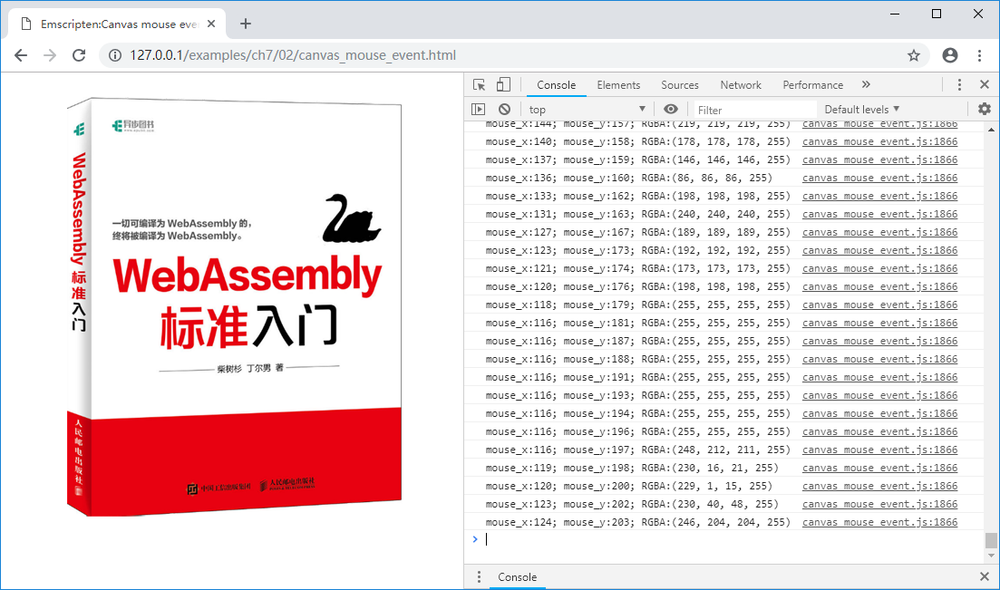

# 7.2 鼠标事件

在JavaScript中，为DOM元素附加事件非常容易。本节就以Canvas为例，介绍鼠标事件的响应方法。

本节的例程创建包含了一个Canvas的页面，当鼠标在Canvas上移动时将调用C函数，输出光标在Canvas中的坐标及该坐标处的像素的颜色（RGBA）值。

html部分代码如下：

```html
//canvas_mouse_event.html
    <canvas id="myCanvas"></canvas>
    <script>
    Module = {};
    Module.onRuntimeInitialized = function() {
      var image=new Image();
      image.src="cover.png";
      image.onload=function() {
        var canvas = document.getElementById('myCanvas');
        var ctx = canvas.getContext("2d");
        canvas.width = image.width;
        canvas.height = image.height;
        ctx.drawImage(image, 0, 0);
        var img_data = ctx.getImageData(0, 0, image.width, image.height).data;

        var buf_addr = Module._get_img_buf(image.width, image.height);
        Module.HEAPU8.set(img_data, buf_addr);  //copy img_data to Emscripten

        canvas.addEventListener("mousemove", onMouseMove, true);
	  }
    }

    function getPointOnCanvas(canvas, x, y) {
      var bbox = canvas.getBoundingClientRect();
      return {
        x: x - bbox.left * (canvas.width / bbox.width),
        y: y - bbox.top * (canvas.height / bbox.height)
      };
    }

    function onMouseMove(event) {
      var canvas = document.getElementById('myCanvas');
      var loc = getPointOnCanvas(canvas, event.clientX, event.clientY);
      Module._on_mouse_move(loc.x, loc.y);
    }
    </script>
    <script src="canvas_mouse_event.js"></script>
```

在`Module`的`onRuntimeInitialized()`回调时，创建了一个`Image`对象，加载`cover.png`图片，图片加载完成后，被更新至Canvas，同时位图数据被复制到C环境中。`canvas.addEventListener()`为鼠标移动添加了事件响应函数，当鼠标移动时，`onMouseMove()`函数将被执行。`onMouseMove()`函数将光标从窗口坐标转为Canvas坐标后，调用C导出函数`Module._on_mouse_move()`执行颜色拾取操作。

C代码如下：

```c
uint8_t *img_buf = NULL;
int img_width = 0, img_height = 0;

EM_PORT_API(uint8_t*) get_img_buf(int w, int h) {
	if (img_buf == NULL || w != img_width || h != img_height) {
		if (img_buf) {
			free(img_buf);
		}
		img_buf = (uint8_t*)malloc(w * h * 4);
		img_width = w;
		img_height = h;
	}

	return img_buf;
}

EM_PORT_API(void) on_mouse_move(int x, int y) {
	if (img_buf == NULL) {
		printf("img_buf not ready!\n");
		return;
	}
	if (x >= img_width || x < 0 || y >= img_height || y <0) {
		printf("out of range!\n");
		return;
	}

	printf("mouse_x:%d; mouse_y:%d; RGBA:(%d, %d, %d, %d)\n", x, y,
		img_buf[(y * img_width + x) * 4],
		img_buf[(y * img_width + x) * 4 + 1],
		img_buf[(y * img_width + x) * 4 + 2],
		img_buf[(y * img_width + x) * 4 + 3]);
}
```

`get_img_buf()`函数与上一节例子中的一致，用于分配保存位图数据的缓冲区；`on_mouse_move()`函数根据传入参数进行颜色拾取和日志输出。

使用以下命令编译：

```
emcc canvas_mouse_event.cc -o canvas_mouse_event.js
```

浏览页面后，在Canvas上移动鼠标，控制台输出如下：


