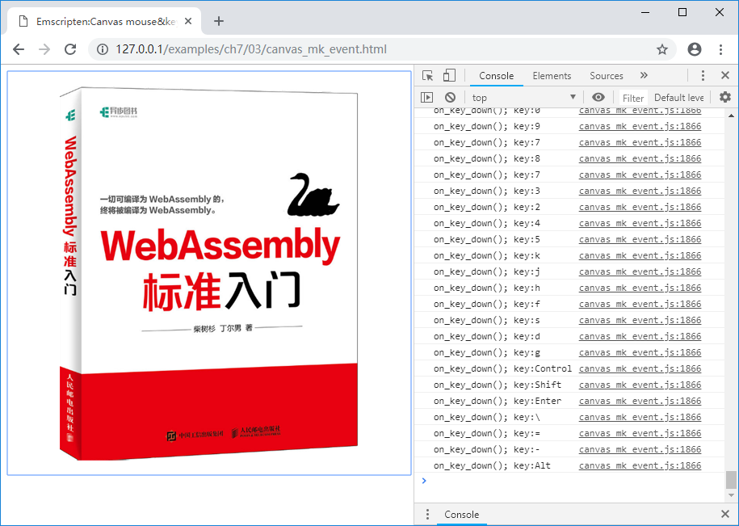

# 7.3 键盘事件

与响应鼠标事件相比，响应Canvas键盘事件没有那么直接，因为Canvas本身并不支持键盘事件的响应。我们需要耍一点小手段——在Canvas上添加一个支持键盘事件的其他对象。

本节的例程将在7.2节例程的基础上添加键盘响应事件。

html部分变更的代码如下：

```html
//canvas_mk_event.html
    <canvas id="myCanvas" tabindex="0"></canvas>
    <script>
    Module = {};
    Module.onRuntimeInitialized = function() {
        //... ...
        canvas.addEventListener("mousemove", onMouseMove, true);
		canvas.addEventListener("keydown", onKeyDown, true);
		canvas.focus();
	  }
    }

    //... ...
	
	function onKeyDown(event) {
	  Module.ccall('on_key_down', 'null', ['string'], [event.key]);
	}
    </script>
    <script src="canvas_mk_event.js"></script>

```

`<canvas id="myCanvas" tabindex="0"></canvas>`在Canvas上附加了`tabindex`元素以支持键盘事件。添加键盘事件响应函数的方法与7.2类似，不再赘述。

C代码中增加了对应的处理函数：

```c
//canvas_mk_event.cc
EM_PORT_API(void) on_key_down(const char* key) {
	printf("on_key_down(); key:%s\n", key);
}
```

使用以下命令编译：

```
emcc canvas_mk_event.cc -s "EXTRA_EXPORTED_RUNTIME_METHODS=['ccall']" -o canvas_mk_event.js
```

浏览页面后，控制台输出如下：

