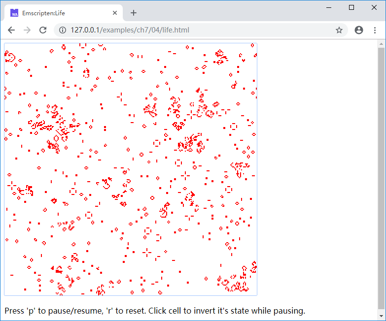

# 7.4 *Life*游戏

本节将综合应用7.1至7.3小节的技术，编写一个完整的交互式小游戏*Life*。

## 7.4.1 `Life`简介

*Life*——全称“Conway's Game of Life”，是一个自运行的小游戏，它模拟了一种虚拟的二维栅格生命，栅格中的每个网格被称为一个细胞，每个细胞有*活*/*死*两种状态，并且细胞状态按照以下规则演变：

- 如果一个活细胞周围的活细胞少于2个，那么下一代它将死掉
- 如果一个活细胞周围的活细胞数量为2个或3个，那么它将继续活至下一代
- 如果一个活细胞周围的活细胞数量超过3个，那么下一代它将死掉
- 如果一个死细胞周围的活细胞数量为3个，那么下一代它将复活

> **info** 这里“周围”的含义是与该细胞邻接的8个细胞，并且代与代之间的状态是整体隔离的，也就是说每个细胞的状态仅取决于它周围的细胞在上一代的状态，游戏的更多详细信息可参阅维基百科：[https://en.wikipedia.org/wiki/Conway%27s_Game_of_Life](https://en.wikipedia.org/wiki/Conway%27s_Game_of_Life)。

## 7.4.2 设计要求

我们将在网页中实现*Life*游戏，希望它有以下功能：

1. 可通过键盘快捷键随机设置所有细胞的状态；
1. 可通过键盘快捷键随时暂停/恢复游戏运行；
1. 在游戏暂停时，可以用鼠标点击某个细胞，使其状态翻转。

## 7.4.3 C代码分析

```c
//life.cc
bool *cells0 = NULL, *cells1 = NULL;
uint32_t *img_buf = NULL;
int width = 0, height = 0;
bool pausing = false;
int scale = 2;

void create_seeds() {
	if (cells0 == NULL) return;

	srand(clock());
	for (int i = 0; i < width * height; i++){
		cells0[i] = (rand() % 2) != 1;
	}
}

EM_PORT_API(void) init_env(int w, int h, int s) {
	if (cells0) free(cells0);
	if (cells1) free(cells1);
	if (img_buf) free(img_buf);

	width = w;
	height = h;
	scale = s;

	cells0 = (bool*)malloc(w * h);
	cells1 = (bool*)malloc(w * h);
	img_buf = (uint32_t*)malloc(w * h * scale * scale * 4);

	create_seeds();
}
```

- 在*Life*中，由于代之间互相隔离，因此我们申请了两块缓冲`cells0`以及`cells1`；
- `img_buf`是最终输出到Canvas的图像缓冲区，由于1个像素在屏幕上非常小难以看清，我们设置了拉伸系数`scale`，1个细胞在图像中将占据`scale * scale`个像素；
- 导出函数`init_env()`用于初始化内部使用的各个缓冲，并保存网格长宽等参数；
- `create_seeds()`函数用于所有细胞状态的随机初始化。

```c
//life.cc
struct DIR{
	int x, y;
};
void evolve(){
	static DIR dirs[] = {{-1, -1}, {0, -1}, {1, -1}, {-1, 0}, {1, 0}, {-1, 1}, {0, 1}, {1, 1}};

	for (int y = 0; y < height; y++) {
		for (int x = 0; x < width; x++) {
			int live_count = 0;
			for (int i = 0; i < 8; i++) {
				int nx = (x + dirs[i].x + width) % width;
				int ny = (y + dirs[i].y + height) % height;
				if (cells0[ny * width + nx]) {
					live_count++;
				}
			}

			if (cells0[y * width + x]) {
				switch (live_count) {
					case 2:
					case 3:
						cells1[y * width + x] = true;
					break;

					default:
						cells1[y * width + x] = false;
					break;
				}
			}
			else {
				switch (live_count) {
					case 3:
						cells1[y * width + x] = true;
					break;

					default:
						cells1[y * width + x] = false;
					break;
				}
			}
		}
	}

	bool *temp = cells0;
	cells0 = cells1;
	cells1 = temp;
}
```

- `evolve()`函数根据*Life*的规则进行演进，每次演进时，根据`cells0`的状态计算`cells1`的状态，然后将二者互相调换。注意我们这里设置了循环二维空间，既从逻辑上来说，网格的最左侧与最右侧是连在一起的、最上侧与最下侧是连在一起的。

```c
//life.cc
EM_PORT_API(uint8_t*) step() {
	if (img_buf == NULL) return NULL;

	if (!pausing) {
		evolve();
	}

	for (int x = 0; x < width; x++){
		for (int y = 0; y < height; y++){
			uint32_t color = cells0[y * width + x] ? 0xFF0000FF : 0xFFFFFFFF;
			for (int i = 0; i < scale; i++){
				for (int j = 0; j < scale; j++){
					int d = ((y * scale + j) * width * scale + x * scale + i);
					img_buf[d] = color;
				}
			}
		}
	}		

	return (uint8_t*)img_buf;
}

EM_PORT_API(void) on_mouse_click(int x, int y){
	if (!pausing) return;

	x /= scale;
	y /= scale;

	if (x < 0 || x >= width || y < 0 || y >= height) return;

	cells0[y * width + x] = !cells0[y * width + x];
}

EM_PORT_API(void) on_key_up(const char* key) {
	if (!key) return;

	switch(*key) {
	case 'p':
		pausing = !pausing;
		break;
	case 'r':
		create_seeds();
		break;
	}
}
```

- 导出函数`step()`根据暂停标志`pausing`决定是否需要进行演进，然后将当前代的状态（`cells0`）转化为图像数据并返回；
- 导出函数`on_mouse_click()`用于响应Canvas的鼠标点击事件；
- 导出函数`on_key_up()`用于响应键盘事件。

## 7.4.4 网页代码分析

```html
//life.html
    <canvas id="myCanvas" tabindex="0"></canvas>
    <p id = 'tip'>Loading WebAssembly...</p>
    <script>
    Module = {};
    Module.onRuntimeInitialized = function() {
      var canvas = document.getElementById('myCanvas');
      var ctx = canvas.getContext("2d");
      canvas.width = 512;
      canvas.height = 512;
      Module._init_env(256, 256, 2);

      canvas.addEventListener("click", onMouseClick, true);
      canvas.addEventListener("keyup", onKeyUp, true);
      canvas.focus();

      window.requestAnimationFrame(update);
      var tip = document.getElementById('tip');
      tip.innerHTML = "Press 'p' to pause/resume, 'r' to reset. Click cell to invert it's state while pausing.";
    }
```

- `Module.onRuntimeInitialized`回调时，初始化*Life*的网格尺寸为256 * 256（拉伸系数为2，因此Canvas尺寸为512 * 512）、设置键盘鼠标的事件响应函数。

```js
//life.html
    function update() {
      var buf_addr = Module._step();
      var u8o = new Uint8ClampedArray(Module.HEAPU8.subarray(buf_addr,
        buf_addr + 512 * 512 * 4));
      var imgData = new ImageData(u8o, 512, 512);

      var canvas = document.getElementById('myCanvas');
      var ctx = canvas.getContext('2d');
      ctx.putImageData(imgData, 0, 0);

      window.requestAnimationFrame(update);
    }
```

- `update()`函数调用C导出的`step()`函数进行演进，同时将结果图像更新至Canvas。

```js
//life.html
    function getPointOnCanvas(canvas, x, y) {
      var bbox = canvas.getBoundingClientRect();
      return {
        x: x - bbox.left * (canvas.width / bbox.width),
        y: y - bbox.top * (canvas.height / bbox.height)
      };    
    }

    function onMouseClick(event) {
      var canvas = document.getElementById('myCanvas');
      var loc = getPointOnCanvas(canvas, event.clientX, event.clientY);
      Module._on_mouse_click(loc.x, loc.y);
    }
	
	  function onKeyUp(event) {
      Module.ccall('on_key_up', 'null', ['string'], [event.key]);
    }
```

- `onMouseClick()`函数用于响应鼠标点击事件；
- `onKeyUp()`函数用于响应键盘操作。

## 7.4.5 运行`Life`

使用以下命令编译：

```
emcc life.cc -s "EXTRA_EXPORTED_RUNTIME_METHODS=['ccall']" -o life.js
```

浏览页面后，将显示细胞的演进，下面是其中一帧截图：



键盘按键‘p’用于切换暂停/运行状态，‘r’用于重新随机初始化；在暂停状态下，用鼠标点击某个细胞可以翻转它的状态。